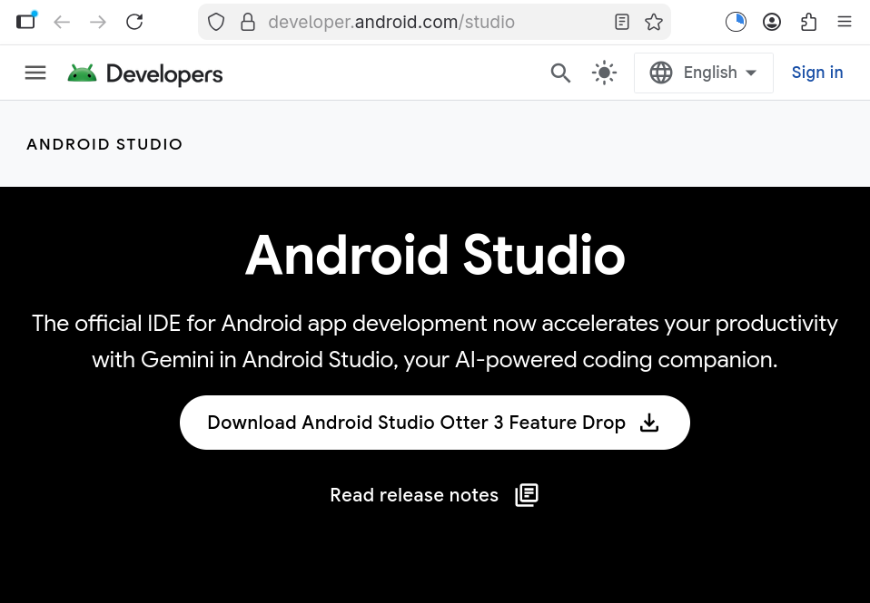
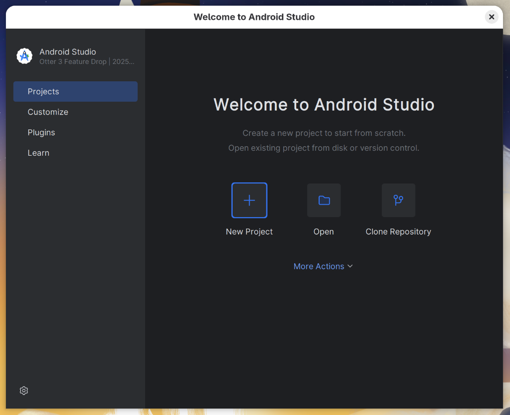
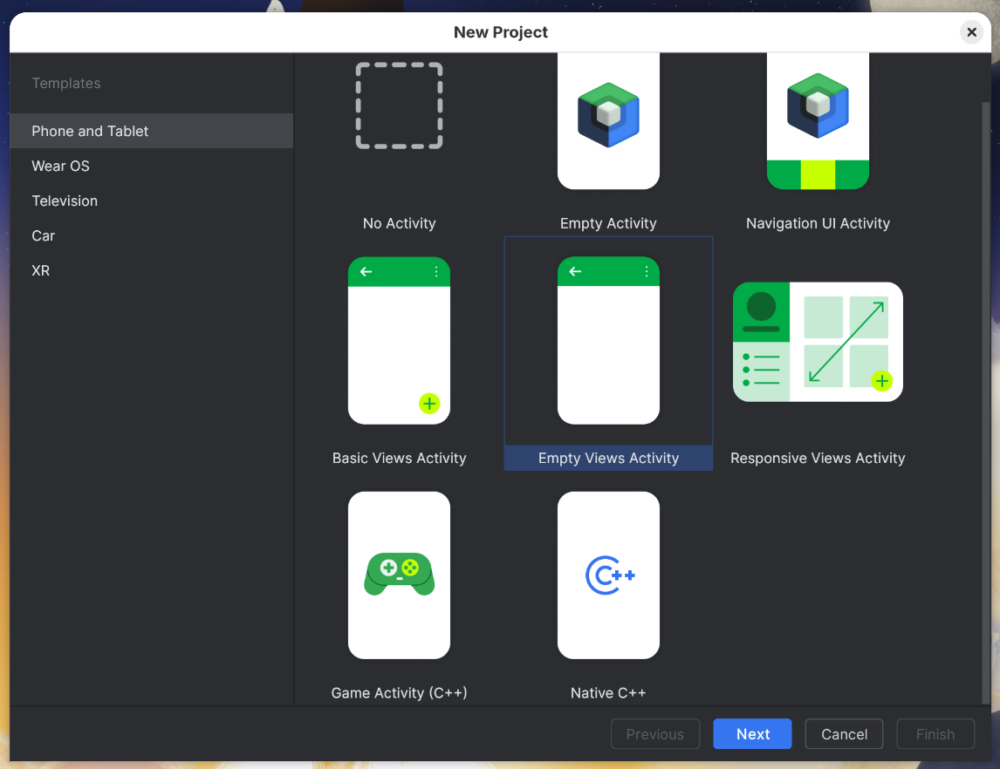
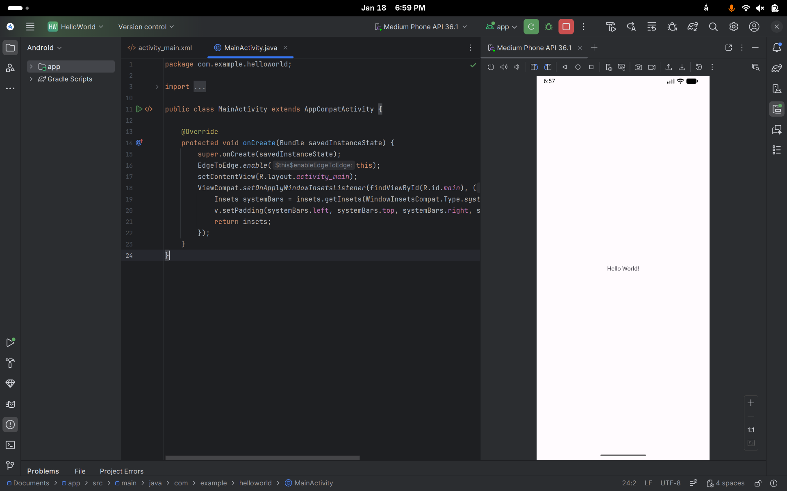

# 1. Installing Android Studio

Hi, today I will show you step by step how to install Android Studio.

## 1.1. For Linux (Fedora 43)

### 1.1.1. Via Android Studio Homepage



- **Step 1:** Visit [Android Studio Homepage](https://developer.android.com/studio).

- **Step 2:** Click the button ***"Download Android Studio Otter 3 Feature Drop"***.

- **Step 3:** Accept all terms and conditions then download the compressed file *tar.gz*.

- **Step 4:** Open your terminal and move to Downloads folder via command: 

    ````    
    cd ~/Downloads
    ````

- **Step 5:** 

    - Extract the downloaded *.tar.gz* file to the */usr/local/* directory:

        ````
        sudo tar -xvf android-studio-*-linux.tar.gz -C /usr/local/
        ````

    - **Note:** For a 64-bit version of Linux, first install the required libraries for 64-bit machines:

        ````
        sudo dnf install zlib ncurses-libs bzip2-libs
        ````

- **Step 6:** Move to the *bin* folder and run the installation script via those 2 commands:

    ````
    cd /usr/local/android-studio/bin
    ./studio.sh
    ````

- **Step 7:** Complete the Setup Wizard.

    - Note: Choose the "Standard" installation type and click Next.

- **Step 8** (Important): Create a Desktop Entry.

    - After the installation is complete, on the "Welcome to Android Studio" screen, click the Options icon (or "Configure") at the bottom left.

    - Select ***"Create Desktop Entry"***.

- **Note:** If there is no selection for create desktop entry, follow the alternative solution below:

    - Open Terminal and create a desktop file:

        ````Bash
        nano ~/.local/share/applications/android-studio.desktop
        ````

    - Paste the following configuration:

        ````Ini, TOML
        [Desktop Entry]
        Version=1.0
        Type=Application
        Name=Android Studio
        Icon=/usr/local/android-studio/bin/studio.svg
        Exec="/usr/local/android-studio/bin/studio.sh" %f
        Comment=The Drive to Develop
        Categories=Development;IDE;
        Terminal=false
        StartupWMClass=jetbrains-studio
        ````

    - Press ***Ctrl+O -> Enter*** to save, then ***Ctrl+X*** to exit.

    - Now, you can search for Android Studio icon on your PC.

### 1.1.2. Via JetBrains Toolbox

# 2. First program: Hello World!

Now that we have installed Android Studio successfully, let's create our first Android application to test the environment.

- **Step 1:** Open Android Studio and click the **"New Project"** button on the Welcome screen.
    
- **Step 2:** Select the Project Template.
    
    - Ensure you are in the **"Phone and Tablet"** tab.
    - Select **"Empty Views Activity"** (This is the standard template for beginners using XML layouts).
    - Click **Next**.

- **Step 3:** Configure the project details:
    - **Name:** `HelloWorld`
    - **Package name:** `com.example.helloworld`
    - **Save location:** Choose a folder to save your project.
    - **Language:** `Kotlin` or `Java`.
    - **Minimum SDK:** Leave it as default (e.g., API 24).
    - Click **Finish**.

- **Step 4:** Wait for Gradle Sync.
    - Android Studio will take a few minutes to download the necessary libraries and build the project.
    - Wait until the loading bars at the bottom right corner disappear.

- **Step 5:** Run the application.
    - Locate the **Run** button (Green Play icon ▶) on the top toolbar.
    - Select an Emulator (e.g., Pixel_API_34) or connect a real device.
    - Click **Run**.

- **Step 6:** Result.
    
    - The Emulator will launch.
    - You should see the application open with the text **"Hello World!"** displayed in the center of the screen.